# Openwrt

[Download OpenWRT 22.03.0 for Raspberry Pi 3B/3B+/3CM (64bit) / Raspberry Pi 2B-1.2 (64bit)](https://firmware-selector.openwrt.org/?version=22.03.0&target=bcm27xx%2Fbcm2710&id=rpi-3)

Flash it to an SD Card using [Raspberry Pi Imager](https://www.raspberrypi.com/software)

Use [GParted](https://gparted.org/) to expand the main partition to the rest of SSD, for instance, if using a 8G expand from 104 to 8G

Put the SSD in the PI and boot it!

# Configure openwrt

Initially Openwrt will have the ip 192.168.1.1 statically defined. 
So either connect it to a network with the same range or change it's IP accordingly (e.g. connecting the PI directly to your machine using a network adapter and a network cable)

The configuration we'll do here will have two interfaces:

- LAN - the one originally setup with 192.168.1.1, which we'll change (or not) according to the network you're going to connect the PI to, in order to download packages or share internet from.

- WAN - the interface used by users connected to the PI via Wifi, use a different IP range than the LAN, in the following screenshots 10.1.1.0 but it can be anything else.

## Disable DHCP in the LAN interface:
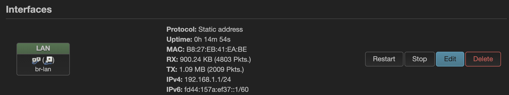
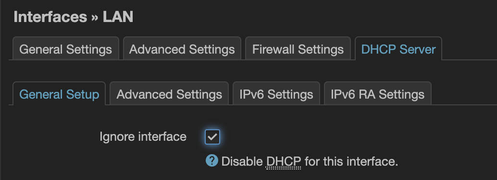

### (Optional) - If you need to change the LAN IP (see comment above), do it now:

In this case my home network is 10.0.1.255 so I've assigned an IP in that range to the LAN interface, I've also set the router and DNS I have in my network:

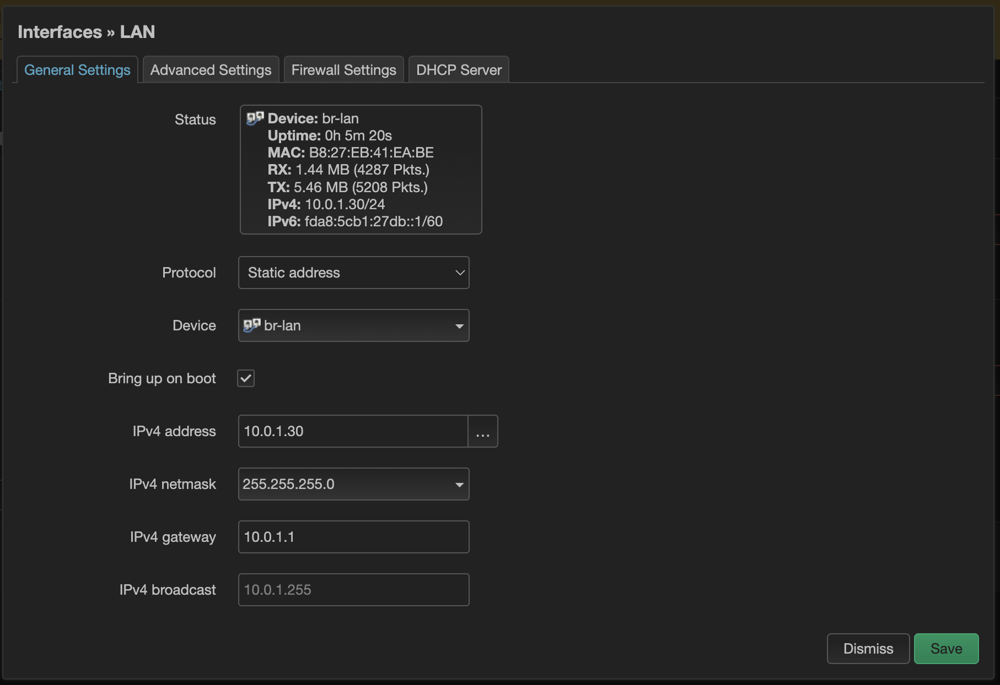
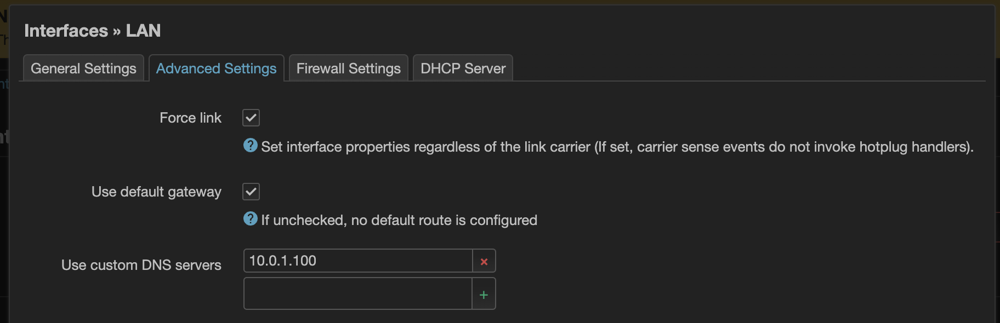

## Cleanup
Navigate to Network – Wireless and remove the default wireless SSID OpenWrt

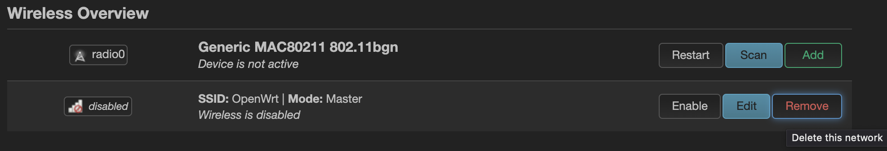

Navigate to Network – Firewall, and under "General Settings" delete all Zones
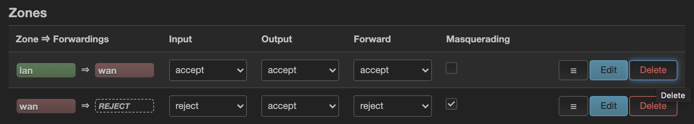

### Save and apply

## Configure

Navigate to Network - Wireless
- Add a new SSID called "Glaum" associated with a network called "Glaum" too.
- Specify you Country Code in order for your device to comply with established international rules (Advanced settings)

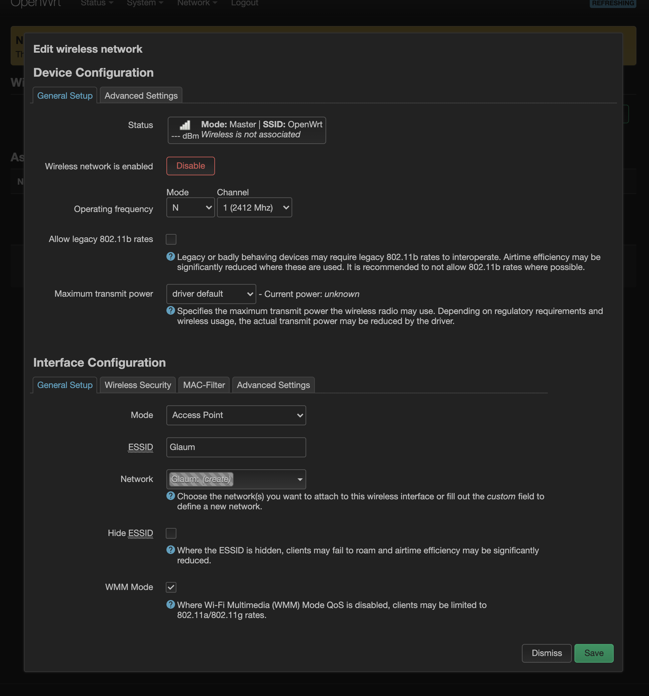

### Save and apply

Navigate to Network – Interface
- Edit the newly created "Glaum" Interface
- "Switch protocol" to "Static address" and configure the IP address and the netmask

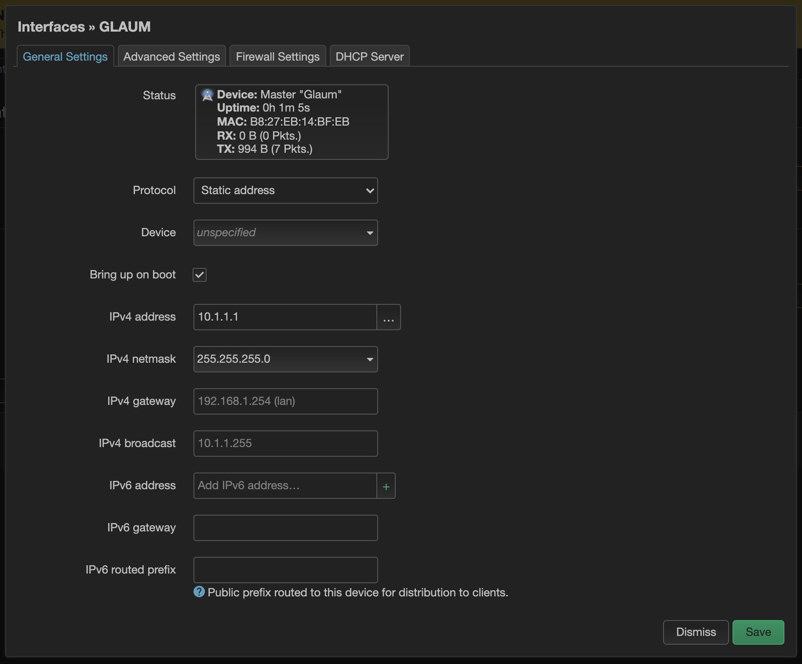

- Enable DHCP

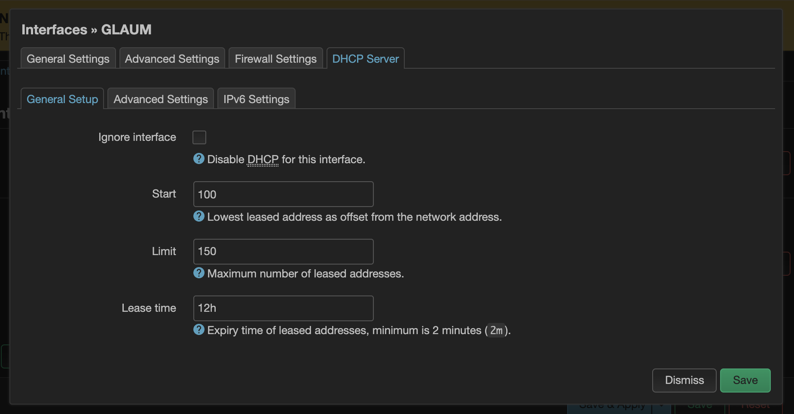

- Create a Firewall zone

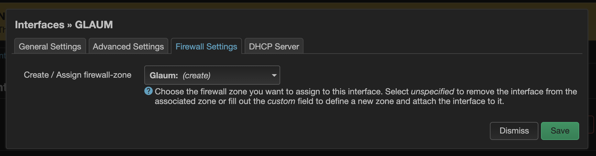

## Create firewall Zones for the LAN Interface
 
Navigate to Network – Interfaces and edit the LAN Interface

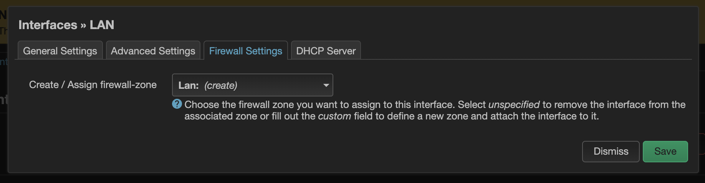

### Save and apply

## Configure the Firewall Zones

Navigate to Network – Firewall, you should now see two zones

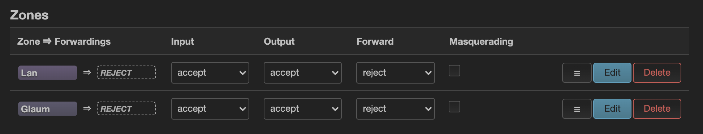

- Configure them accordingly:

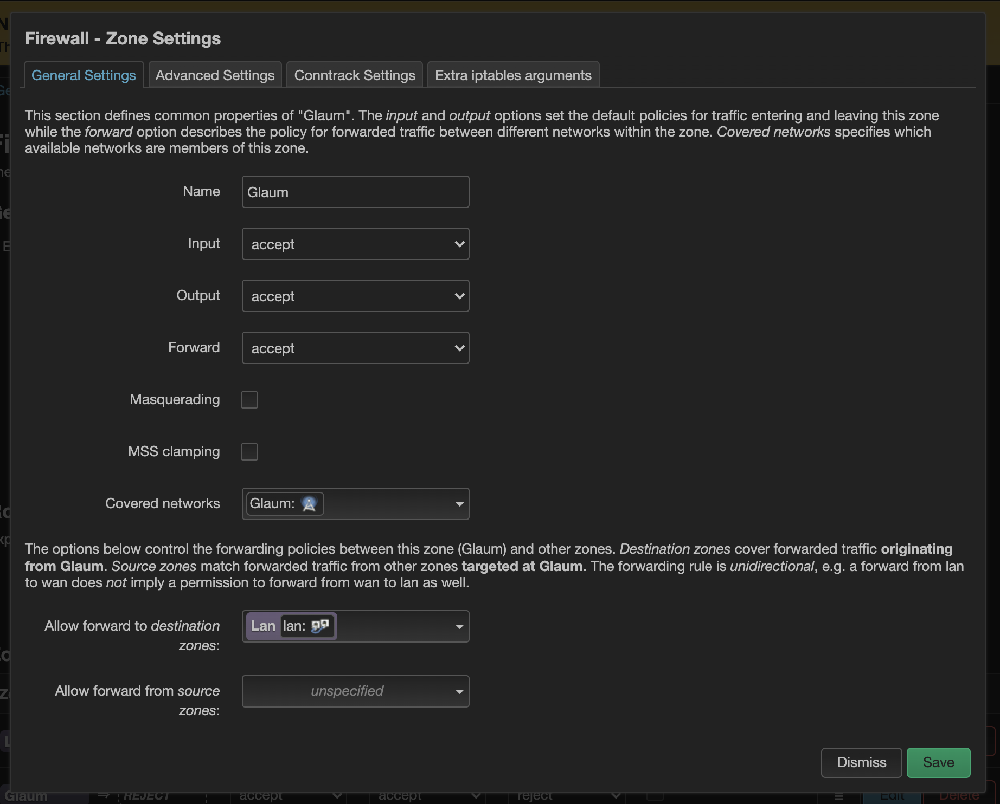
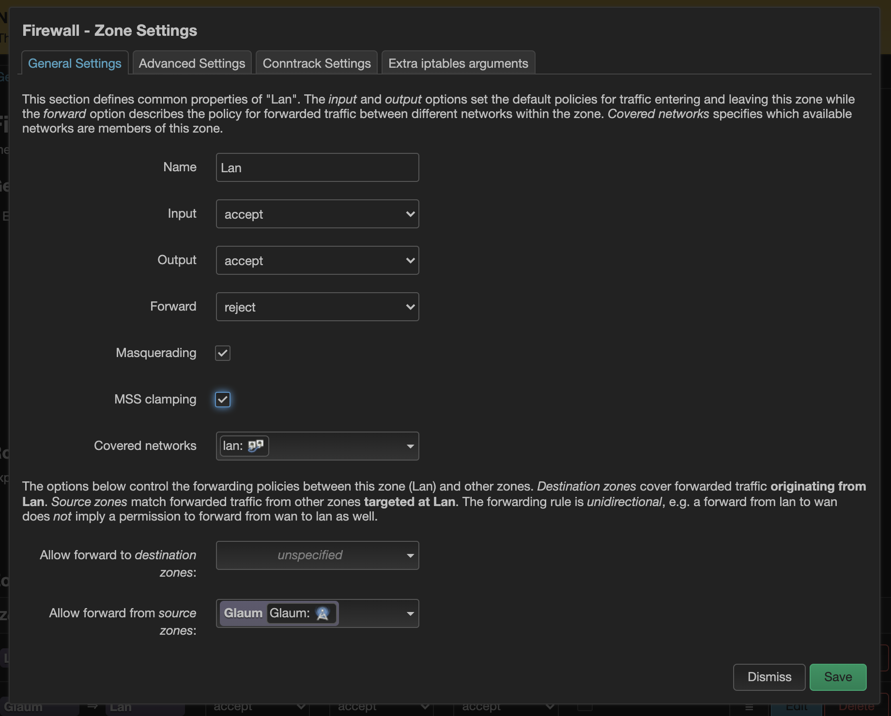

### Save and apply

## Network should be available at this point:

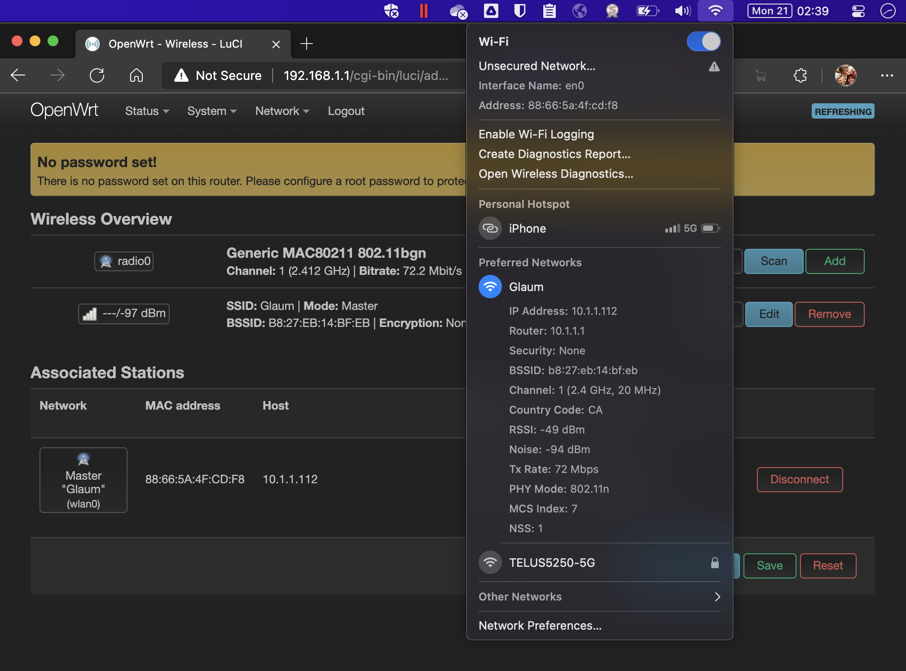

## You should also be able to update the packages:

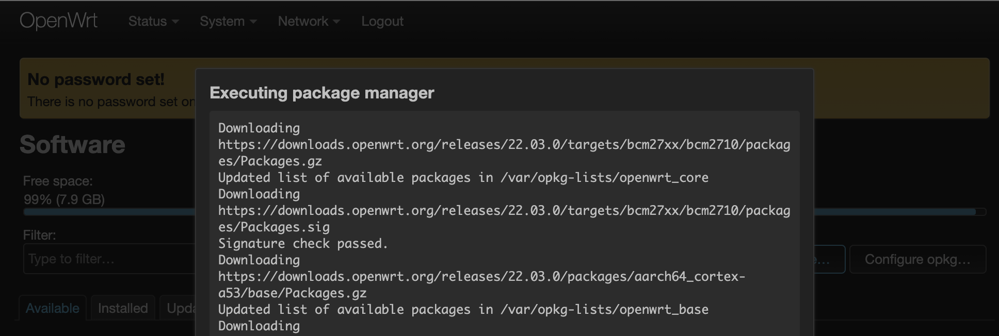

---------------------------
---------------------------
---------------------------
---------------------------
---------------------------
---------------------------
---------------------------
# Original tuturials where this was based of:

https://gremaudpi.emf-informatique.ch/create-a-routed-access-point-with-raspberry-pi-and-openwrt/

https://gremaudpi.emf-informatique.ch/how-to-create-a-standalone-captive-portal-with-coova-chilli-and-freeradius-on-a-raspberry-pi-running-openwrt/

https://gremaudpi.emf-informatique.ch/how-to-build-a-captive-portal-with-coova-chilli-and-a-local-splash-page-on-a-raspberry-pi-running-openwrt/